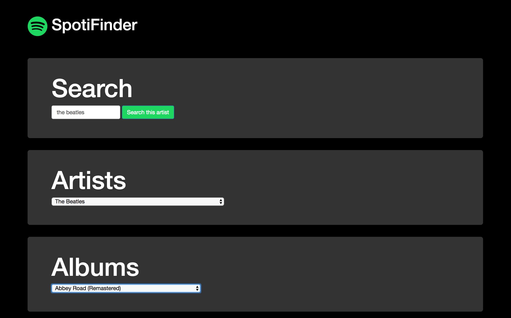
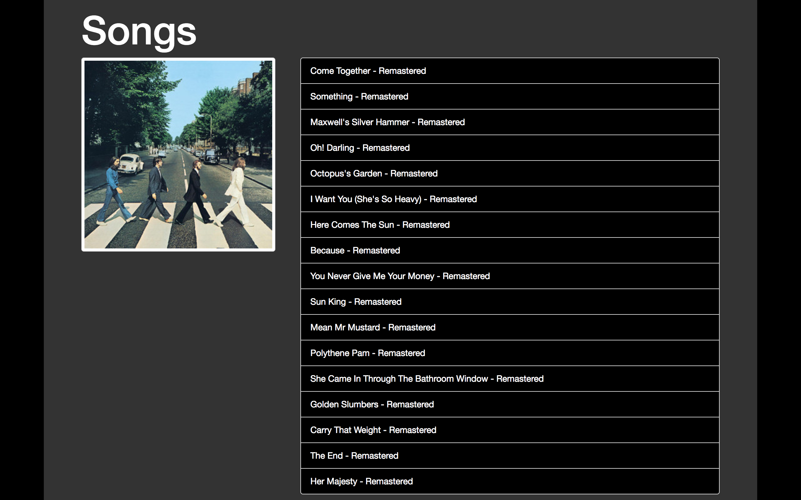

   

# [Spotifinder](https://tsatsan.github.io/spotifinderJquery) #

## Description ##

This repository contains a Spotify webapp made with HTML, CSS and jQuery in the [Skylab Coders Academy](http://www.skylabcoders.com/es/) Full Stack Web Development Bootcamp.

With **Spotifinder Web App** you can search your favorite artist and list their albums and the album's tracks. If you click on the song, it will open Spotify and it will play.

[Here](https://github.com/juanmaguitar/exercises-javascript/tree/master/04-jquery-spotify-API) you can see the description of the exercise and [here](https://tsatsan.github.io/spotifinderJquery) you can follow my progress.

